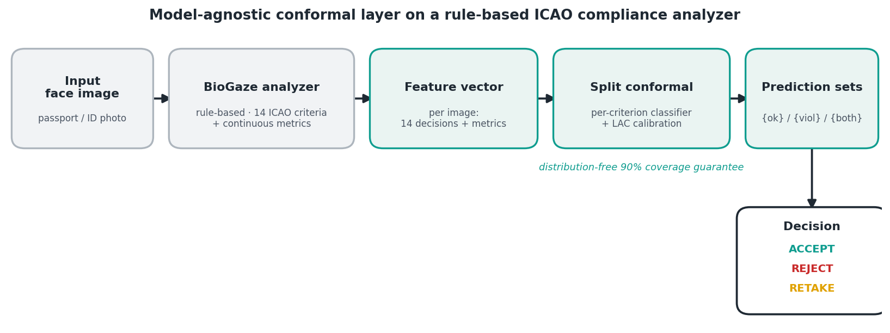
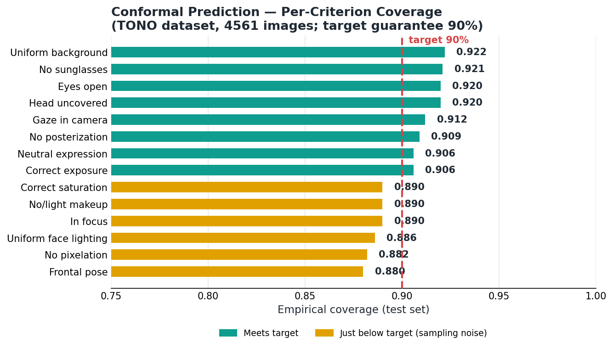
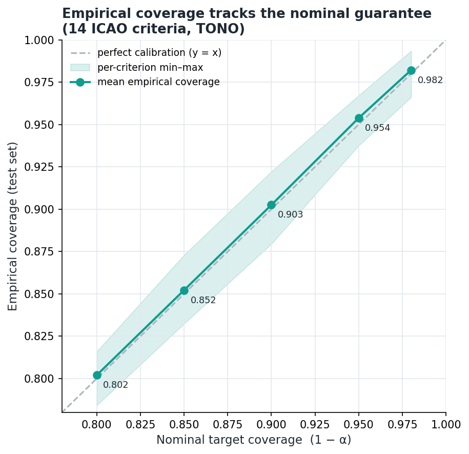
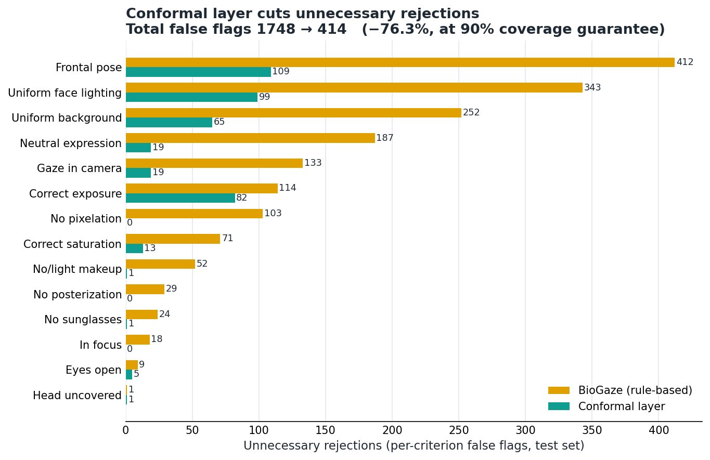

# Conformal Prediction for Reliable ICAO Face-Image Compliance Verification

A model-agnostic **conformal-prediction layer** on top of a rule-based ICAO/ISO
face-image compliance analyzer (**BioGaze**). It attaches a distribution-free
**coverage guarantee** to each per-criterion compliance decision and adds an
**ACCEPT / REJECT / RETAKE** framework that reduces unnecessary photo retakes.

**Author:** Mustafa Vedat Yıldırım — Oxford Brookes University, BSc Artificial Intelligence
**Supervisor:** Dr. Inna Skarga-Bandurova

---

## Headline results (TONO, 4,561 images)

- **Coverage guarantee holds** across all 14 ICAO criteria: mean empirical coverage
  **0.9024** at a 0.90 target, and it tracks the nominal level across confidence
  levels (0.80→0.802, 0.90→0.903, 0.98→0.982).
- **−76.3% unnecessary rejections**: per-criterion false flags drop from **1,748 → 414**
  vs. the raw rule-based analyzer, while keeping the coverage guarantee (uncertain true
  violations are routed to RETAKE, never silently accepted).






## Paper

A draft (methodology & results, with 5 figures + coverage table and real references) is
included: `results/Paper1_draft.docx` (editable) and `results/Paper1_draft.pdf`.

## Data

[TONO synthetic dataset](https://miatbiolab.csr.unibo.it/tono-synthetic-dataset/)
(MI@BioLab, University of Bologna; CC BY-NC 4.0), single-violation partition — the folder
name gives per-criterion ground truth. The dataset itself is **not** redistributed here.

## Method (see `results/pipeline.png`)

1. **BioGaze** ([repo](https://github.com/Maphoz/BioGaze)) → per-image 14 binary ICAO
   decisions + continuous metrics. `batch_predict.py` (resume + per-image timeout).
2. Per-criterion probabilistic classifier + **MAPIE** split conformal (LAC, 60/20/20)
   → prediction sets at a 90% coverage target. `conformal_analysis.py`.
3. Figures: `make_charts.py` (coverage), `make_calibration.py` (reliability),
   `make_retake_chart.py` (retake), `make_pipeline.py` (pipeline),
   `make_xai_panel.py` (region-level explanations). Paper: `build_paper.js`.

## Reproduce

```bash
pip install -r requirements.txt
# BioGaze predictions (needs the BioGaze stack: torch, dlib, mediapipe, ultralytics, rmn):
#   python batch_predict.py -i <TONO/release> -o tono_full_pred.csv
python conformal_analysis.py --csv tono_full_pred.csv --out results
python make_charts.py && python make_calibration.py && python make_retake_chart.py && python make_pipeline.py
```

## Results files

`results/`: `coverage_table.csv`, `summary.json`, and figures
(`coverage_chart`, `calibration`, `retake_chart`, `pipeline`, `xai/xai_panel`) as PNG + SVG.

## Explainability

Region-level explanations (BiSeNet segmentation + 68 landmarks) faithful to the
rule-based decisions, aligned with pixel-level FIQA interpretability
(`results/xai/xai_panel.png`, `make_xai_panel.py`).

## Next steps

- Class-conditional (Mondrian) conformal to strengthen violation-class coverage.
- Real, multi-violation validation (DFIC) in a follow-up study (Paper 2).

## License / attribution

Research code, non-commercial. BioGaze and TONO retain their own licenses; cite TONO
(Borghi et al., ECCV 2024 Workshops) and BioGaze (FG 2025) if used.
